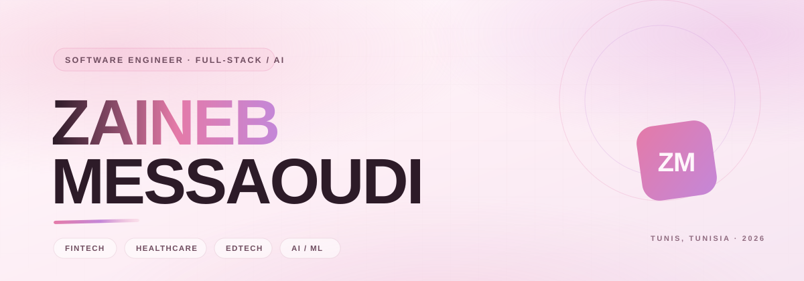
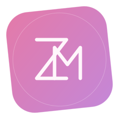

 

**Full-stack products across fintech, healthcare, and accessibility — with production AI.**

[Portfolio](https://zainebportfolio.vercel.app/) &nbsp;·&nbsp; [LinkedIn](https://linkedin.com/in/zaineb-messaoudi-ab7b61252) &nbsp;·&nbsp; [Email](mailto:zaineb.messaoudi@esprit.tn) &nbsp;·&nbsp; Tunis, Tunisia

 

### 01 — SIGNAL

Four internships, five shipped products, numbers instead of adjectives.

<table>
<tr>
<td align="center" width="20%"><h2>40%</h2>BCT — collaboration cycle reduced</td>
<td align="center" width="20%"><h2>60%</h2>I-Way — per-file processing time cut</td>
<td align="center" width="20%"><h2>0.88</h2>TalentLens — salary model R²</td>
<td align="center" width="20%"><h2>&lt;500ms</h2>I-Way — P95 latency at load</td>
<td align="center" width="20%"><h2>2 mo</h2>HikmaLearn — accessibility platform, start to WCAG audit</td>
</tr>
</table>

### 02 — SELECTED WORK

 

**01 / TALENTLENS** — *ML · HR Intelligence · Lead Machine Learning*

HR intelligence platform built with a 5-person team. Led the Career Machine Learning module: salary prediction, career-trajectory classification, and SHAP-based explainability, alongside anomaly detection, employee segmentation, and job recommendation.

<table>
<tr>
<td align="center" width="50%"><h3>0.88</h3>R² — salary regression</td>
<td align="center" width="50%"><h3>0.75</h3>AUC — career classification</td>
</tr>
</table>

`PYTHON` `XGBOOST` `LIGHTGBM` `SCIKIT-LEARN` `SHAP` `PANDAS` `REACT`

 

**02 / ORALIS** — *Full-Stack · Speech AI*

AI-powered platform for evaluating oral presentations, built with a 5-person team: speech-to-text conversion, filler-word detection, pause analysis, and pronunciation scoring, behind JWT auth and role-based access control. Containerized and shipped through a CI/CD pipeline.

`REACT` `NESTJS` `FASTAPI` `PYTHON` `MONGODB` `DOCKER` `JWT` `RBAC`

 

**03 / HIKMALEARN** — *Full-Stack · Accessibility · Esprit Tech*

Full-stack accessibility platform for students with disabilities, designed and delivered in two months on a 6-person team — ReactJS frontend, Django REST backend, deployed to production and passed a **WCAG 2.1** audit. Shipped automated video captioning, screen-reader support, keyboard navigation, and AI-generated image descriptions.

`REACT` `DJANGO REST` `WCAG 2.1` `A11Y`

 

**04 / MATERNITY & PREGNANCY TRACKING PLATFORM** — *Full-Stack · Cross-Platform*

Multi-platform pregnancy and maternity tracker spanning **Web, Mobile, and Desktop**, built with a 6-person team with consistent data synchronization across all three clients, backed by Firebase and SQL persistence.

`SYMFONY` `PHP` `FLUTTERFLOW` `FIREBASE` `JAVAFX` `SQL`

### 03 — EXPERIENCE

**Full Stack Developer Intern** · QCMed · Remote &nbsp;06/2026 – 08/2026
- Shipped React + NestJS quiz/challenge modules with granular resident progress tracking
- Built a Node.js REST API exposing MongoDB-aggregated answer statistics, with a real-time WebSocket-synced admin dashboard
- Optimized the partial-credit scoring engine and wired AWS SES notification workflows

**Web Developer Intern** · Esprit Tech · Ariana, Tunis &nbsp;07/2025 – 08/2025
- Delivered HikmaLearn — ReactJS + Django REST — in 2 months, passing a WCAG 2.1 accessibility audit
- Shipped automated captioning, screen-reader support, keyboard navigation, and AI-generated image descriptions
- Worked in two-week sprints on a 6-person team with systematic code review

**Web Developer Intern** · Banque Centrale de Tunisie (BCT) · Tunis &nbsp;02/2024 – 06/2024
- Replaced a manual, Excel-based inter-departmental coordination process — cutting the collaboration cycle by **40%**
- Built role-based access control, a complete audit trail, and calendar/logistics management
- Spring Boot, Java, Thymeleaf, SQL backend; Figma prototyping; delivered in 2-week agile sprints

**Odoo Developer Intern** · I-Way · Manar 1, Tunis &nbsp;07/2022 – 08/2022
- Automated the patient appointment booking workflow, eliminating manual processing — **60%** faster per file
- Tuned PostgreSQL queries and application-level caching to hold P95 latency **under 500ms**
- Supported production deployment with cross-team functional validation

### 04 — STACK

**Core**
`REACT` `TYPESCRIPT` `NESTJS` `FASTAPI` `PYTHON` `JAVA` `SPRING BOOT` `MONGODB` `POSTGRESQL` `DOCKER` `XGBOOST` `LIGHTGBM` `SHAP`

Also worked with — Angular · JavaFX · Symfony · PHP · C/C++ · Firebase · MySQL · Django · Jenkins · Kubernetes · Figma · Adobe Creative Suite · Jira · Scrum / Kanban / Agile

### 05 — EDUCATION & CERTIFICATIONS

| Education | |
|---|---|
| Engineering Degree — Software Engineering (TWIN, Web & Internet Technologies) · ESPRIT School of Engineering | Expected 10/2027 |
| Bachelor's — Computer Science & Multimedia · ISAMM | 06/2024 |

| Certifications | |
|---|---|
| MongoDB CRUD Operations · MongoDB | 12/2025 |
| Prompt Engineering and Generative AI · Coursera (ODC) | 06/2025 |
| Microsoft Azure Fundamentals (AZ-900) · Microsoft Learn | 07/2024 |
| Full Stack Web Development · freeCodeCamp | 07/2023 |
| Machine Learning with Python · freeCodeCamp | 06/2023 |

### 06 — LANGUAGES

Arabic — Native &nbsp;·&nbsp; French — Fluent &nbsp;·&nbsp; English — Intermediate

 
 

**Open to final-year internships (6 months+) starting January — Software Engineering, Web Development, or Applied AI/ML.**

[Portfolio](https://zainebportfolio.vercel.app/) &nbsp;·&nbsp; [LinkedIn](https://linkedin.com/in/zaineb-messaoudi-ab7b61252) &nbsp;·&nbsp; [Email](mailto:zaineb.messaoudi@esprit.tn)

Open source · AI · design · reading, mostly in that order.

