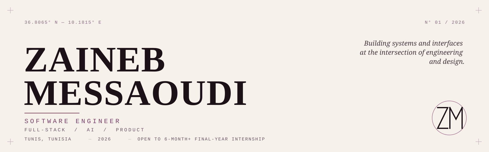

<div align="center">

<picture>
  <source media="(prefers-color-scheme: dark)" srcset="assets/hero-dark.svg">
  
</picture>

</div>

<br>

<table>
<tr>
<td width="68%" valign="top">

*Third-year Software Engineering student at ESPRIT, working across full-stack systems and applied AI.*
*Four internships — fintech, healthcare, edtech.*
*Currently building toward a final-year internship, six months or longer, starting January.*

</td>
<td width="32%" valign="top">

```
LOCATION    Tunis, TN
FOCUS       Full-Stack / AI
STATUS      Open to internship
START       January 2027
DURATION    6 months+
```

</td>
</tr>
</table>

<br>

### 01 — SELECTED WORK

<br>

**TalentLens** · `2026`
<sub>Lead, Machine Learning</sub>

HR intelligence platform built within a five-person team. Salary prediction and career trajectory models — R² 0.88, AUC 0.75 — with SHAP explainability for transparent, actionable insight.

`Python` `XGBoost` `LightGBM` `SHAP` `React`

<br>

---

<br>

**Oralis** · `2026`
<sub>Full Stack Developer</sub>

AI-evaluated public speaking platform — speech-to-text, filler-word detection, pause analysis, pronunciation scoring. JWT-secured, containerized, shipped through CI/CD.

`React` `NestJS` `FastAPI` `Docker`

<br>

---

<br>

**HIKMALEARN** · `2025`
<sub>Web Developer — Esprit Tech</sub>

Full-stack accessibility platform for students with disabilities, delivered in two months and passed a WCAG 2.1 audit. Automated captioning, screen-reader support, AI-generated image descriptions.

`React` `Django` `Accessibility`

<br>

---

<br>

**Maternity & Pregnancy Tracker** · `2025`
<sub>Full Stack Developer</sub>

Multi-platform application — web, mobile, desktop — with synchronized data across all three, built within a six-person team.

`Symfony` `FlutterFlow` `Firebase` `JavaFX`

<br>

<div align="right"><sub><a href="https://zainebportfolio.vercel.app/">full case studies &#8594;</a></sub></div>

<br>

### 02 — EXPERIENCE

```
2026        QCMed                            Full Stack Developer Intern
2025        Esprit Tech                       Web Developer Intern — HIKMALEARN
2024        Banque Centrale de Tunisie        Web Developer Intern
2022        I-Way                             Odoo Developer Intern
```

<br>

### 03 — CAPABILITIES

```
LANGUAGES     Java · TypeScript · Python · PHP · C / C++
FRONTEND      React · Angular · JavaFX
BACKEND       NestJS · FastAPI · Spring Boot · Django · Symfony
DATA / AI     Machine Learning · NLP · XGBoost · SHAP
INFRA         Docker · Kubernetes · Git · CI/CD
```

<br>

### 04 — CONNECT

<picture>
  <source media="(prefers-color-scheme: dark)" srcset="assets/monogram-dark.svg">
  
</picture>

<sub>[Portfolio](https://zainebportfolio.vercel.app/) &nbsp;&#8212;&nbsp; [LinkedIn](https://linkedin.com/in/zaineb-messaoudi-ab7b61252) &nbsp;&#8212;&nbsp; [Email](mailto:zaineb.messaoudi@esprit.tn)</sub>
