<!-- =========================================================
     Zaineb Messaoudi — GitHub Profile README
     Drop this file + the assets/ folder into
     github.com/Zaineb-Messaoudi/Zaineb-Messaoudi
     ========================================================= -->

  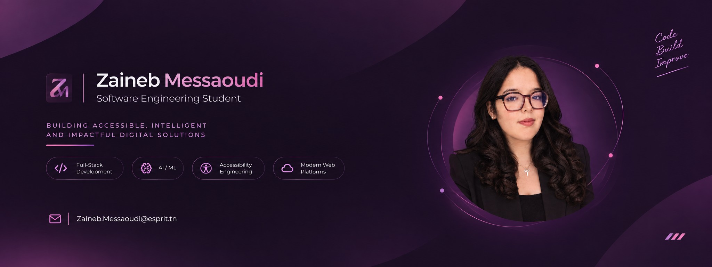

 

  <picture>
    <source media="(prefers-color-scheme: dark)" srcset="assets/logo-dark.png" />
    <source media="(prefers-color-scheme: light)" srcset="assets/logo-light.png" />
    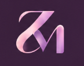
  </picture>

  

  
  
  
  
  

  
  

 

  
  
  
  
  
  
  

 

<table>
<tr>
<td width="28%" align="center" valign="top">
  
    
  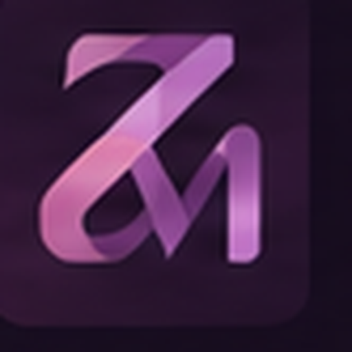
   
  <b>Zaineb Messaoudi</b>
   
  Software Engineering Student · Full-Stack & AI
    
  
  
  
</td>
<td width="72%" valign="top">

### About

Third-year **Software Engineering** student at **ESPRIT** (TWIN — Web & Internet Technologies), with a Bachelor's in Computer Science & Multimedia from **ISAMM**. Four internships across **fintech, healthcare, and edtech**. I design interfaces, ship backend architecture, deploy it, and fold AI in where it actually helps.

- **Full-stack in production** — React, NestJS, Spring Boot, Django, FastAPI
- **Applied ML** — salary models at R² 0.88, SHAP explainability, speech evaluation
- **Accessibility as a delivery constraint** — HikmaLearn, WCAG 2.1, two months start to audit
- **Seeking** a 6-month or longer final-year internship starting **January 2027** in Software Engineering, Web Development, or Applied AI/ML — also open to junior and freelance work in the meantime

> **Currently** — wrapping up coursework for TWIN year 3 at ESPRIT and scoping January 2027 PFE opportunities.

Modern · Clean · Elegant · Approachable · Software Engineering

</td>
</tr>
</table>

### 01 — Signal

Four internships. Five shipped products. Numbers instead of adjectives.

  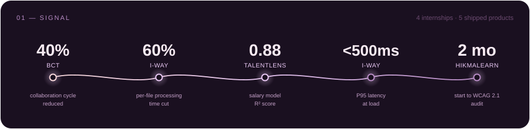

### 02 — Selected work

**01 / TALENTLENS** — *ML · HR Intelligence · Lead Machine Learning*

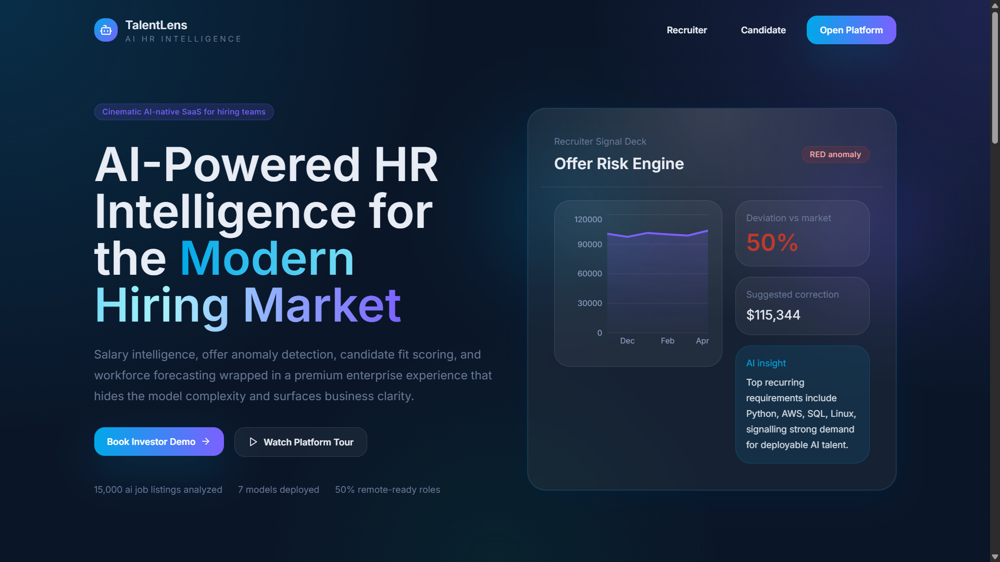

[Repo ↗](https://github.com/Zaineb-Messaoudi/TalentLens-BuildDream-ProjectML) &nbsp;·&nbsp; [Live demo ↗](https://talent-lens-build-dream-project-ml.vercel.app/)

> Turning HR guesswork into a model you can actually explain.

HR intelligence platform with a 5-person team. Led the Career Machine Learning module: salary prediction, career-trajectory classification, and SHAP-based explainability, plus anomaly detection, employee segmentation, and job recommendation.

<table>
<tr>
<td align="center" width="50%"><h3>0.88</h3>R² — salary regression</td>
<td align="center" width="50%"><h3>0.75</h3>AUC — career classification</td>
</tr>
</table>

<b>Behind the build</b> — problem, decisions, trade-offs

 

**Problem.** HR teams sit on years of structured employee data but still set salary bands and career paths by intuition. A model that only outputs a number doesn't help — nobody acts on a recommendation they can't justify to a candidate.

**Gradient boosting over deep learning.** The dataset was tabular and mid-sized, where XGBoost and LightGBM reliably beat neural nets while training in seconds — fast training mattered more than squeezing out marginal accuracy, since it meant iterating on features many times in one semester.

**Explainability as a requirement, not a nice-to-have.** SHAP TreeExplainer was added so every prediction ships with its contributing factors and supports what-if scenarios — the deciding reason to stay with tree models over a harder-to-explain alternative.

**Reporting the weaker score honestly.** Career classification landed at AUC 0.75, noticeably below salary regression. Rather than tune on the test set, the held-out evaluation stayed intact and the gap became a finding: career trajectory depends on context the dataset doesn't capture.

Tech stack

 

`PYTHON` `XGBOOST` `LIGHTGBM` `SCIKIT-LEARN` `SHAP` `PANDAS` `REACT`

 

**02 / ORALIS** — *Full-Stack · Speech AI*

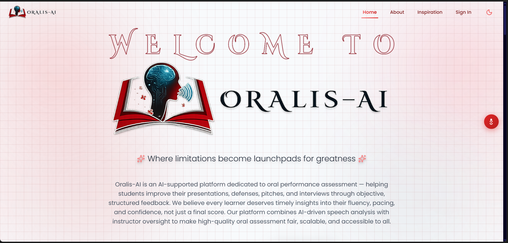

[Repo ↗](https://github.com/Zaineb-Messaoudi/Esprit-PIWEB-4TWIN7-2026-AI-Web-Platform-for-Oral-Assessment) &nbsp;·&nbsp; [Live demo ↗](https://esprit-piweb-4-twin-7-2026-ai-web-p.vercel.app/)

> Grading how well someone speaks — not just what they typed.

AI-powered platform for evaluating oral presentations, built with a 5-person team: speech-to-text, filler-word detection, pause analysis, and pronunciation scoring, behind JWT auth and role-based access control. Containerized and shipped through a CI/CD pipeline.

<b>Behind the build</b> — problem, decisions, trade-offs

 

**Problem.** Instructors grading oral presentations rely on memory and rough notes, so feedback arrives late, varies between graders, and rarely points to anything a student can concretely practise.

**Split the Node and Python layers.** Speech processing needed the Python ML ecosystem, but the product API needed conventions the rest of the team already knew — NestJS ran the product API, FastAPI ran the audio pipeline, keeping slow inference off the request path serving the UI.

**Scoring signals over a single grade.** One opaque number would have felt arbitrary to students. Reporting separate signals — filler words, pause distribution, pronunciation — costs more UI work but makes every score traceable to something the student can hear in their own recording.

**RBAC before features.** Student recordings are sensitive, so JWT auth and role-based access went in before the analysis features rather than being retrofitted — it slowed the first demo but meant instructor-only routes were never briefly public.

Tech stack

 

`REACT` `NESTJS` `FASTAPI` `PYTHON` `MONGODB` `DOCKER` `JWT` `RBAC`

 

**03 / HIKMALEARN** — *Full-Stack · Accessibility · Esprit Tech*

> Built so the audit wouldn't just pass — it wouldn't need special-casing.

Full-stack accessibility platform for students with disabilities, designed and delivered in two months on a 6-person team — ReactJS frontend, Django REST backend, deployed to production and passed a **WCAG 2.1** audit. Shipped automated video captioning, screen-reader support, keyboard navigation, and AI-generated image descriptions.

Tech stack

 

`REACT` `DJANGO REST` `WCAG 2.1` `A11Y`

 

**04 / MOTHERISE** — *Pregnancy & maternity tracking · Web, Mobile, Desktop*

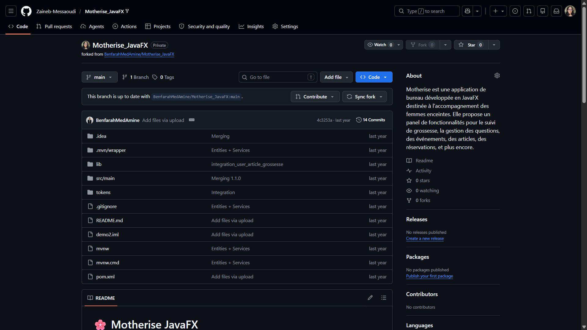

[Repo ↗](https://github.com/Zaineb-Messaoudi/symfony-motherise-evenement)

> One data model, three interfaces, zero drift.

Multi-platform pregnancy and maternity tracker spanning **Web, Mobile, and Desktop**, built with a 6-person team with consistent data synchronization across all three clients, backed by Firebase and SQL persistence.

<b>Behind the build</b> — problem, decisions, trade-offs

 

**Problem.** Pregnancy tracking isn't a single-device activity — appointments get logged on a phone, reviewed on a laptop, discussed at a desk. Three separate apps with three separate sources of truth would have been worse than no app at all.

**One data contract, three clients.** The hardest part was never any single client — it was keeping Symfony, FlutterFlow, and JavaFX agreeing on the same records. The data model stayed fixed and each platform differed only in presentation.

**Firebase alongside SQL, not instead of it.** Relational SQL suited the structured medical records; Firebase handled the sync and real-time paths mobile needed. Running both added integration overhead but avoided bending one store into a job it was poor at.

**Accepting unfamiliar stacks.** The stack was set by the coursework, not chosen — delivering JavaFX and FlutterFlow surfaces neither used before was the real constraint, and the fastest way to learn to read unfamiliar framework docs under a deadline.

Tech stack

 

`SYMFONY` `PHP` `FLUTTERFLOW` `FIREBASE` `JAVAFX` `SQL`

### 03 — Experience

  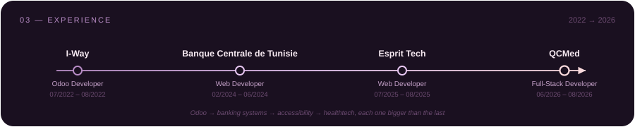

 

**Full Stack Developer Intern** · QCMed · Remote &nbsp;06/2026 – 08/2026  
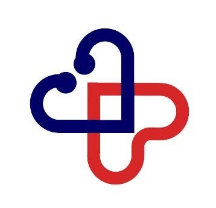
- Shipped React + NestJS quiz/challenge modules with granular resident progress tracking
- Built a Node.js REST API exposing MongoDB-aggregated answer statistics, with a real-time WebSocket-synced admin dashboard
- Optimized the partial-credit scoring engine and wired AWS SES notification workflows

**Web Developer Intern** · Esprit Tech · Ariana, Tunis &nbsp;07/2025 – 08/2025  
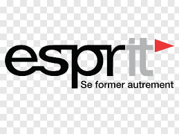
- Delivered HikmaLearn — ReactJS + Django REST — in 2 months, passing a WCAG 2.1 accessibility audit
- Shipped automated captioning, screen-reader support, keyboard navigation, and AI-generated image descriptions
- Worked in two-week sprints on a 6-person team with systematic code review

**Web Developer Intern** · Banque Centrale de Tunisie (BCT) · Tunis &nbsp;02/2024 – 06/2024  

- Replaced a manual, Excel-based inter-departmental coordination process — cutting the collaboration cycle by **40%**
- Built role-based access control, a complete audit trail, and calendar/logistics management
- Spring Boot, Java, Thymeleaf, SQL backend; Figma prototyping; delivered in 2-week agile sprints

**Odoo Developer Intern** · I-Way · Manar 1, Tunis &nbsp;07/2022 – 08/2022  
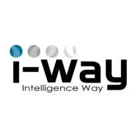
- Automated the patient appointment booking workflow, eliminating manual processing — **60%** faster per file
- Tuned PostgreSQL queries and application-level caching to hold P95 latency **under 500ms**
- Supported production deployment with cross-team functional validation

### 04 — Technical arsenal

  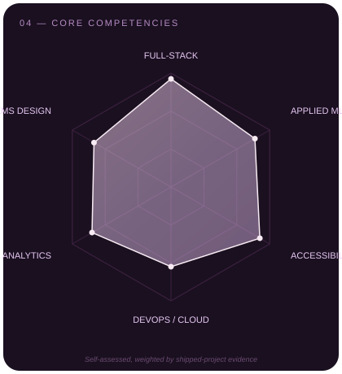

 

**Frontend**

**Backend & APIs**

**Languages**

**Data & ML**

**Infra & data stores**

**Also in the toolbox**

`JavaFX` `Adobe Creative Suite` `Jira` `Scrum / Kanban / Agile`

### 05 — GitHub activity

  
  

  

  

### 06 — Education & certifications

**ESPRIT School of Engineering** — *Software Engineering, TWIN (Web & Internet Technologies)*  
Expected 10/2027 · Tunis, Tunisia
- BuildDream team: 3 cross-disciplinary academic projects spanning AI, microservices, and accessibility
- Hextech team: 3 synchronized platforms delivered simultaneously across web, mobile, and desktop

**ISAMM, Manouba** — *Bachelor's Degree, Computer Science & Multimedia*  
06/2024 · Manouba, Tunisia
- Foundation in software design, UX design, 2D work, and multimedia programming

 

  
  
  
   
  
  

### 07 — Languages

Arabic — Native &nbsp;·&nbsp; French — Fluent &nbsp;·&nbsp; English — Intermediate

 

  
    
  <b>Open to final-year internships (6 months+) starting January 2027 — Software Engineering, Web Development, or Applied AI/ML.</b>
   
  Also open to junior and freelance opportunities in the meantime.
    
  <a href="https://zainebportfolio.vercel.app/">Portfolio</a> &nbsp;·&nbsp;
  <a href="https://linkedin.com/in/zaineb-messaoudi-ab7b61252">LinkedIn</a> &nbsp;·&nbsp;
  <a href="https://github.com/Zaineb-Messaoudi">GitHub</a> &nbsp;·&nbsp;
  <a href="assets/cv-en.pdf">Résumé</a> &nbsp;·&nbsp;
  <a href="mailto:zaineb.messaoudi@esprit.tn">Email</a>
    
  Open source · AI · design · reading, mostly in that order.

